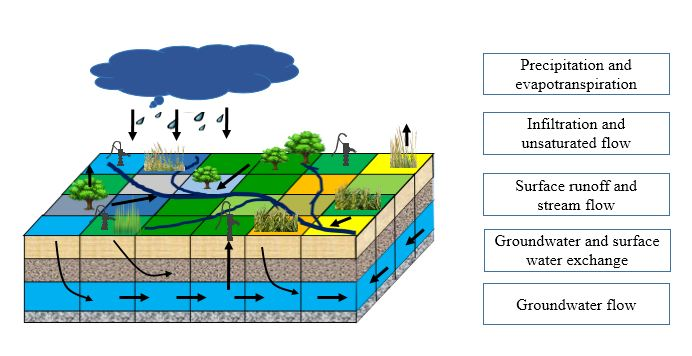
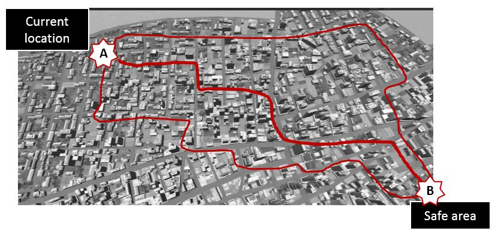

Group current research interests include:

* Eco-hydrological processes under the influence of water management policies in arid regions

* Opinion dynamics and evacuation behaviors during natural disasters

***

**1. 干旱区水资源管理政策对流域水文水循环的影响**

解析干旱区农业水资源管理对地表水和地下水水文过程的影响是水资源管理的重要内容。本研究选取我国典型干旱内陆河流域黑河流域中游为研究区，以农户个体的决策机制为切入点，解析水资源政策影响下农户个体的农作物种植和灌溉决策机制，构建模型模拟水资源政策影响下的农业用水过程，进而将该模型与研究区分布式地表水-地下水水文模型进行耦合，探究水文变量在研究区的空间分布特征和变化规律，揭示水资源管理政策对地表水和地下水水文过程的影响机理和作用机制。

***

**2. 自然灾害下的舆情动力学与紧急撤离模拟**

在自然灾害（如洪水）情境下，对居民进行及时有效的灾情告知和撤离安排是灾害防护的重要内容。本研究侧重于以居民个体的决策过程为出发点，研究各种灾情告知手段（如广播、电视、社交媒体等）对居民风险认知的影响，并且研究居民之间的信息互动如何影响居民的风险认识，以此构建自然灾害情景下的舆情动力学模型。通过将舆情动力学模型与交通模型的耦合，研究不同灾情处理政策下的居民应急响应。

***